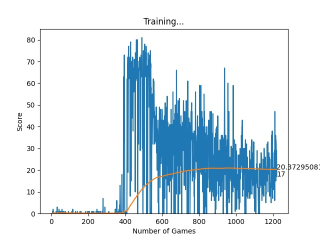

# Implementing a Reinforcement Learning based Snake AI Agent using PyTorch and PyGame
Training a model using negative or positive rewards
is termed as Reinforcement Learning and extending it using
neural networks is known as Deep Q-Learning. Using these
two methodologies and libraries like PyGame, PyTorch, etc., this
project report focuses on explaining how an agent can be trained
to play the snake game and score as high as possible.


## Installation
Creating a virtual environment
```bash
pip3 install virtualenv
virtualenv venv
source venv/bin/activate
```

Use the package manager [pip](https://pip.pypa.io/en/stable/) to install the dependencies.

```bash
pip3 install -r requirements.txt
pip3 install torch torchvision --extra-index-url https://download.pytorch.org/whl/cpu
```

## Usage

```bash
python3 agent.py
```
## Results



## [Report](media/report.pdf)
## Contributing

Pull requests are welcome. For major changes, please open an issue first
to discuss what you would like to change.

Please make sure to update tests as appropriate.

## License

[MIT](https://choosealicense.com/licenses/mit/)